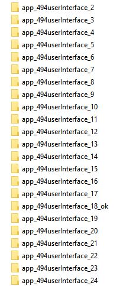
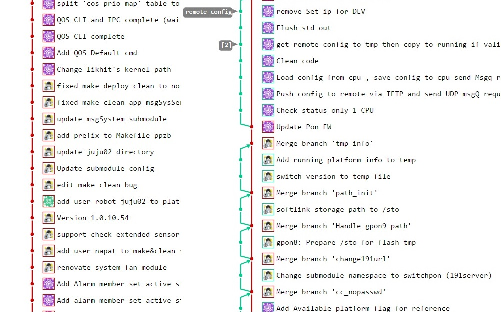
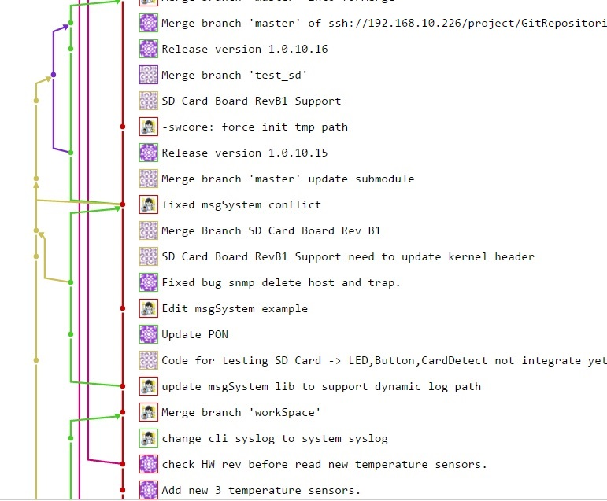
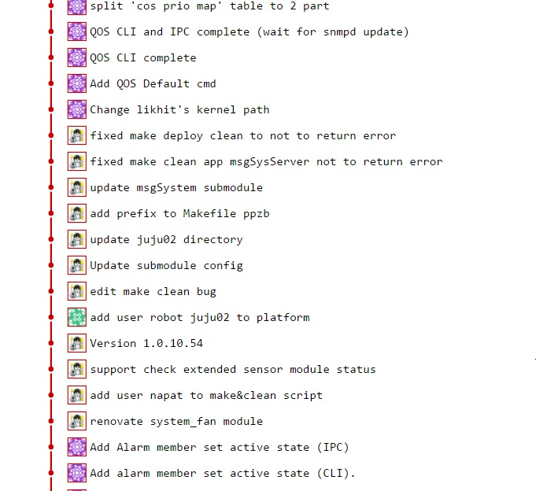
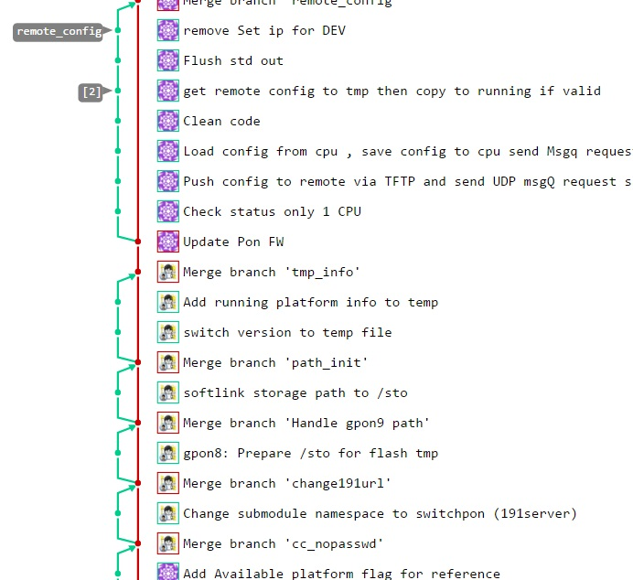

# Sublime packages
- [GitGutter](https://github.com/jisaacks/GitGutter) 
  
# Graphical git client   
- [GitKraken](https://www.gitkraken.com/) Windows/Linux/OSX. Free for personal and small startup.   
- [SmartGit](http://www.syntevo.com/smartgit/) Windows/Linux/OSX. Free if being used for private projects not meant to be profitable and not an open source license.     
- [SourceTree](https://www.sourcetreeapp.com/) Windows/OSX. Free Git client.  
- [TortoiseGit](https://tortoisegit.org/) Windows. Free Git client familiar with TortoiseSVN. 
- [GithubDesktop](https://desktop.github.com/) Windows/OSX. Free and easy to use especially for git novices but not for geek.    
  
# Browser Extension
- [Octotree](https://github.com/buunguyen/octotree) Browser extension (Chrome, Firefox, Opera and Safari) to show a code tree on GitHub.  
  
# Useful
- [GitIgnoreIO](https://www.gitignore.io/) To create .gitignore files for your project.  
  
--------------------------------------------------------------
# CHAPTER01: Version control & git setup & git config & status of staging 
Old story
- No time capsule snapshot(Time log and history tracking)
- Collaboration issues(i.e. Editing same source code, multi-tasking)




Version control systems
- Central Repository (Repository what??)
 + Online(remote) repo only (i.e. subversion)
- Distributed Repository[Distributed version controlsystem: DVCS]
 + Support both Online(remote) and Offline(local) repository committing 



## First to know, Git config

Git configuration use to keep many config like developer's name, email, status coloring, diff, tools, alias commands and more.
When executing, git then look for config at 3 levels location.
There are 4 options to select config write location,
`--system`, `--global`, `--local` and `--file <filename>`.

`git config --system`: Write config for entire system(all users/projects).
 + Config stored in `/etc/gitconfig`

`git config --global`: Write config for all projects for current user. 
 + Config stored in `~/.gitconfig`(or `~/.config/git/config`) file

`git config` or `git config --local`: By default, git config values are writed to current project config file.
 + Config stored in `<project dir>/.git/config`.

`git config --file <filename>`: There is optional write config to any specific path, maybe to use when replace export linux's env to non-standard values. See Somehack belows.

The first place Git looks for the values is `system` level, the next is `global` level. 
Finally, Git looks for configuration values in `local`(project) level.
** project overrides global and global overrides system. **

Some hack:
We can also point the environment variable `GIT_CONFIG` to a file that git config should use. With `GIT_CONFIG=~/.gitconfig-A git config key value` the specified file gets manipulated.

For example to setup configuration for global/local repositories
```
# To set global config
git config --global username "Bumble Bee"
git config --global user.email chev@camaro.com
git config --global color.ui <auto/true>    # I prefer to use true
git help

# More tools
git config --global core.editor emacs
git config --global merge.tool opendiff

# To set local config(Local config will load after and override the global config)
git config user.email "Napat Rungruangbangchan"

# List config (Same key can set twice, the second will override the previous listing)
git config --list

# To verify running config of any repository
git config user.email  

```

Useful config to set color of git status
```
[color "status"]  
  added = green bold  
  changed = yellow bold  
  untracked = red bold
```

Create new git repository
```
mkdir trygit
cd trygit

# Creates a new local repository
git init

# Folder .git is created after git init command
ls -a | grep .git
drwxrwxrwx 2 root root     0 Jun 30 18:09 .git

```

## Git staging status
`git status` To see any status
- Untracked 
- Tracked
 + Unstaging area (changed/modified)
 + Staging area (ready to take snapshot)

- `git add <file01> <file01> ...` Move anything from any stage to *Staging area*
 + Add the list of files: `git add file1 file2 ...`
 + Add all file `git add --all`
 + Add all file in directory `git add source/`
 + Add all txt files in current directory `git add *.txt`
 + Add all txt files in any directory `git add docs/*.txt`
 + Use *Double quotes* to add all txt files in the whole project `git add "*.txt"`

## Commit
`git commit` Take snapshot of those staging
 + `-a` Automatic add changes from all tracked files
 + `-m` to comment, **Use present tense comment**  

### Basic commit
```
git commit -a -m "some message"
```

### Using commit template: communication/collabolation/documentation
1. Create `commit_msg_template.txt` template  
```
$ cat commit_msg_template.txt
# Some awesome title (concise, ideally in 50 characters or fewer)

# Body (bug/issue tracking no/feature description)

# Documentation/ Notes

```

2. Set project template  
```
$ cd <project_dir>
$ cp </path/of/commit_msg_template.txt> commit_msg_template.txt
$ git add commit_msg_template.txt
$ git config commit.template commit_msg_template.txt
$ git commit 
```

3. Check setting
```
$ cat .gitconfig | grep template 
template = commit_msg_template.txt
```

## Basic Log
```
git log
git log --oneline --graph
```

-----------------------------------------------------
# CHAPTER02: head, HEAD, Reset, Diff, Unstage,Unindex, Update-index and basic working with remote(1)

## head
A head is simply a reference to a commit object. 
Each head has a name (branch name or tag name, etc). 
By default, there is a head in every repository called master. 
A repository can contain any number of heads.
## HEAD
HEAD(all capitals head) is the exclusive head to reference to the current position. 
To see what HEAD points to by doing
```
$ cat .git/HEAD
ref: ref/heads/master
```
### Detached HEAD
It is possible for HEAD to refer to a specific revision that is not associated with a branch name. 
This situation is called a [detached HEAD](https://git-scm.com/docs/git-checkout#_detached_head).

## Reset
- Unstage change using reset
 + `git reset <commit>` Undoes all commits after [commit] preserving changes locally
 + `git reset HEAD` Move all staged back to unstage area 
 + `git reset <file>` Unstages the file but preserve its contents
 
- Undoing a commmit using reset to the snapshot **Note: Don't do these after you push**
 + `git reset --hard HEAD^` Undo last commit and all changes
 + `git reset --soft HEAD^` Reset changes into staging
 + `git reset HEAD <file>...` To unstage file
 
- Edit last commit(new commit message or add something) **Note: Whatever has been staged is added to last commit**
 ```
 git add somethingToLastCommit.txt
 git commit --amend -m "The new commit message"
 ```
- Change author and Email of last commit 
```
git commit --amend --author="NewFirstname NewLastname <NewEmail@domain>"
```

- Discard changes in working(unstage)
 + `git checkout -- <file>` 

## Diff
- Check differences(`git diff`)
 + `git diff` , `git diff HEAD` Shows file differences not yet staged(unstage area)
 + `git diff --staged` Shows file differences between staging and the last commit

## Rm
- Remove/Unindex(`git rm ...`)
    + `git rm xyz.c`
    + `git rm --cached abc.log` If already tracked files and don't want to delete from local file system, only remove from git repository

## Update-index
- Update-index (**Settings only apply to local repository, other devs need to independent set Update-index configs**)
 + `git update-index --assume-unchanged pathToFile` Start ignoring the changes to the file  
 + `git update-index --no-assume-unchanged pathToFile` Keeping track again
 + `git ls-files -v|grep '^h'` Get a list of dir's/files that are assume-unchanged
 
# Working with REMOTE
 - `origin`: default first remote name

## Add remote(like bookmark in browser)
 - `git remote add origin <remote addr>`

## Show remote
 - `git remote -v`

## Push local to remote
 - `git push -u <remote name> <local branch name to push>`

Note `-u` to remember remote name so next time can type only `git push`

# Pull (fetch and merge to current branch)
 - `git pull`
 - `git pull <remote name>`
 
 i.e. 
 Merge the remote branch next into the current branch 
 - `$ git pull origin next`

 is the same as 
```
$ git fetch origin
$ git merge origin/next
```

-------------------------------------
# CHAPTER03: basic working with remote(2), Branching and merge

## Cloning
 1. Download to local dir
 2. Add `origin` remote pointing to clone URL
 3. Initial branch master and HEAD

 - `git clone <https://remoteUrl/repo-name.git>` Clones a project to local directory using repository name(default)

 - `git clone <https://remoteUrl/repo-name.git> localnamedir` Clones a project to specific local directory

## Branching

 - Create branch and checkout
```
git branch feature1
git checkout feature1
```

is the same as `git checkout -b feature1`

 - Merge branch 
```
git checkout master
git merge feature1
```

    + Fast-forward merge
        ++ By default when no change in current branch, git will merge by fast-forward method.
    + Non-fast-forward merge
        ++ `Recursive stratrgy`: If changes were made in both branches
        ++ Config force non-fast-forward merge<Optional>

## vi commands
```
`j` Down     `k`up    `ESC` leave mode  `:wq` save & quit
`h` left     `l`right `i` insert mode   `:q!` cancle & quit
```

 - Delete branch
    + `git branch -d <branch name>` delete only when already merging  
    + `git branch -D <branch name>` always delete the branch

--------------------------------------------------------------
# CHAPTER04: Basic Collaboration
git work flow: Dev work only on master branch

```
*Senario1*
A: push
B: clone
A&B: edit (different code segments)
A:push
B:push ----> !! error, rejected
B: pull (using: fetch & merge--> Git work flow: merge commit strategy)
B: push
```

```
*Senario2*
A: push
B: clone
A&B: edit (same code segments)
A:push
B:push ----> !! error, rejected
B: pull (using: fetch & merge) ----> !! content Conflict 
B: git status
    & see conflict files 
    & talk to A 
    & manual fixed conflict
B: git commit -a -m "Fixed conflict bla bla..."
B: push
```

- Merge commit strategy
Log graph then looks something like


## Avoiding Git Disasters ## 
Merging may feels like tons of pain when there are tons of changes long time no sync.
 

--------------------------------------------------------------
# CHAPTER05: remote branch & tags
keyword: stale tracking branches issue

Push local branch to remote
`git push origin <feature01>`

To see all remote branches
```
# Need to sync with remote
git pull
git branch -r
git checkout <feature01>
```

Or (prefered)
```
# No need to sync with remote
git remote show origin
```

 - Remove a remote branch
    + `git push origin :<branchName>`
    or 
    + `git push origin --delete <branchName>`

Note that other dev that already sync deleted branch will have **stale tracking branches** issue.
To clean local reference(origin) with deleted remote branchs then using
## remote prune
`git remote prune origin`

*Senario5.1*
```
A&B: git pull origin feature01
A: git push origin --delete feature01
B: new commit & git push ----!!! Everything up-to-date (stale tracking branches)
B: git remote show origin ----(see stale remote branches)
B: git remote prune origin
```

To track different local branch name to remote branch name
`git push origin <localBranch>:<remoteBranch>`

Ex: push staging branch to master
```
git checkout staging
git push heroku-staging staging:master
```

Tagging (reference to a commit used mostly for release versioning)

List all tags
`git tag`

Checkout to any tag
`git checkout <tagName>`

To add a new tag
`git tag -a <tagName> -m "Comment about this tag"`

To push news tags
`git push --tags`

--------------------------------------------------------------
# CHAPTER06: rebase
Tag: Git work flow, Rebase strategy



- Rebase do three things
    1. Move all current working branch changes(commits) to temporary area.
    2. Apply all base branch commits to working branch.
    3. Apply all commits from temporary area one at a time.

 - Rebase conflict commands
    + When resolved issue then continue with commands
        ```
        git status
        git add <resolve files>
        git rebase --continue
        ```

    + If prefer to skip this patch(skip only this commit)
        ```
        git rebase --skip
        ```
    + To abort the rebase process
        ```
        git rebase --abort
        ```

--------------------------------------------------------------
# CHAPTER07: history, log, diff, blame, gitignore file, explicit repository excludes, Aliases
Info: `git help log`

## Git log
```
git log
git log --graph
git log --pretty=oneline
git log --oneline
git log --graph --oneline
```

 - Log patch(diff) using `-p`
    + `git log --oneline -p`

 - Log ranges By latest commits
    + `git log -3`

 - Log ranges By time
    + `git log --until=1.minute.ago`
    + `git log --since=1.day.ago`
    + `git log --since=1.hour.ago`
    + `git log --since=1.month.ago --until=2.weeks.ago`
    + `git log --since=2010-01-01 --until=2011-12-31`

 - Log format 
    + `git log --pretty-format:"%h %ad- %s [%an]"`

```
Placeholder     Replace with
%ad             author date
%an             author name
%h              SHA hash
%s              subject
%d              ref names
```

 - Log stat(line change) using `--stat` 
    + `git log --oneline --stat`

## Git diff
```
git diff              # same as git diff HEAD
git diff HEAD^
git diff HEAD^^ HEAD^
git diff HEAD~2 HEAD~1
git diff HEAD~2 HEAD -- main.c  # show only diff of main.c file

git diff f5abca ed189a

git diff master feature01

git diff --since=1.week.ago --until=1.minute.ago
```

Note `--` use to tell git the following argument is file name

## Git blame
 - To see the commits that change any files
    + `git blame main.c --date short`

## Git ignore
 - Excluding from all copies of cloning by add the rules to `.gitignore` file.
Need to add .gitignore file to the repository.

## Explicit repository excludes
- If you don't want to create a `.gitignore` file to share with others, 
you can create rules that are not committed with the repository 
by write the exclude list into `.git/info/exclude`
No need to add .gitignore file to the repository.

## Aliases

```
# git mylog
git config --global alias.mylog "log --pretty=format: '%h %s [%an]' --graph"

# git lol
git config --global alias.lol \
"log --graph --decorate --pretty=oneline --abbrex-commit -all"

# git st
git config --global alias.st status

# git co
git config --global alias.co checkout

# git br
git config --global alias.br branch

# git ci
git config --global alias.ci commit

```

```
# git config
[alias]
search = log --no-merges -i -E --pretty='%h (%ad) - [%an] %s %d' --date=format:'%b %d %Y' --grep
vgrep = grep --extended-regexp --break --heading --line-number

# To use search
$ git search "pattern"
$ git grep "pattern"
```

--------------------------------------------------------------
# Collaborate strategy(Git work flow): Rebase and No-Fast-forward strategy
- Developers work only on master branch(and no strategy)
    + Bad practice, only for very beginner
    
- Merge commit strategy
    + Still for noob, messy log graph
    
    
- Rebase strategy
    + Simple log graph


- No-Fast-forward strategy
    + Easy to checkout history when buggy
    
    + Note: Dev still need to smaller the task to be fast-feedback collaboration 


## No-Fast-forward strategy setup

```
# Config no fast-forward when merge the master branch
git config branch.master.mergeoptions  "--no-ff"
# or stop using no fast forward for all merging by  
git config --add merge.ff false

# Fixed git pull(fetch & merge) to be fetch & rebase 
git config pull.rebase true

# Short summary
cd <.git repository>
git config branch.master.mergeoptions "--no-ff"
git config pull.rebase true

```

# Things to do EVERY morning
```
git checkout master
git pull origin master
git checkout <branch_dev>
git rebase master
```

# Before go home
 - Please push any commits and resources that other developers may use for new release.

--------------------------------------------------------------
# Collaborate, command for reviwer to see diff between feature and mainline branch  

ref: `https://stackoverflow.com/questions/20808892/git-diff-between-current-branch-and-master-but-not-including-unmerged-master-com`

When reviewer need to see change between feature and mainline, they can use  "git diff" with hash of base commit. There are some easy way to fine that bash hash,   
Let's say our feature branch name is `feature1` that branching from `master` branch. We can get hash of `branch point` by using erge-base,   

```
git merge-base feature1 master
fba7c14598a3e36f7a4ee0b956b68d21d64c195d
```

So, to get all change of `feature1` with `branch point` we can use,

```
# To diff feature1 against basis
git diff `git merge-base feature1 master`..feature1

# or
git diff $(git merge-base feature1 master)..feature1

# or 
git diff $(git merge-base --fork-point master dev)..dev

# or if current branch is already on feature1
git diff `git merge-base feature1 master`
```

--------------------------------------------------------------
# Merging Two(or more) Git Repositories Into One Repository Without Losing File History

```
# 1.Create a new empty repository New
mkdir newrepo
cd newrepo
git init   

# 2.Make a dummy commit because we need to have  an initial commmit before we do a merge.
touch dummy.txt
git add .
git commit -m "Init dummy commit"

# 3.Add a oldProjA remote and fetch the old repo to new branch
git remote add -f oldProjA <oldProjA repo URL>
git checkout oldProjA/master
git checkout -b editOldProjA

# 4.Move projectA's objects to new dir to prevent merge conflict with other project
mkdir <projADir>
git mv <all projA files and folder> <projADir>
git commit -m "Move projA to new dir"

# 5.merge projA to master branch using unrelated histories option
git checkout master
git merge --allow-unrelated-histories newb_proA

# Do the same approach(3-5) to other repository
#...

```

--------------------------------------------------------------
## Some hack: How to set .git directory to different path with source code

```
Ref: 
- http://stackoverflow.com/questions/17913550/git-moving-the-git-directory-to-another-drive-keep-the-source-code-where-it
```

Options   
1. Use `symlink`(linux) or `junction.exe`(windows)
2. Clone with option --separate-git-dir
`git clone --separate-git-dir=<path to directory for repo> <remote url> <path for working copy>`
3. Set up using `--git-dir=<path>` and `--work-tree=<path>`
4. Using same approach with submodules
    4.1 Move .git directory to where it need to be(ex: `~/googledrive/.git`).   
    4.2 Create .git file with value: `gitdir: ~/googledrive/.git`
    4.3 Define core.worktree to point at the working space

```
# Option 4 example
cd ~/workspace/project_foo
mv .git ~/googledrive/.git
echo "gitdir: ~/googledrive/.git" > .git
git config core.worktree $PWD
```

Note:   
Imagin when you move .git to cloud storage directory that will automatic backup files and folder, now you may sync your repository with out remote server, but this is not recommended by me, it's just for fun. :P 

--------------------------------------------------------------
# Patch Linux Kernel
After create new branch(patch_branch) and commit source code with [Sign-off requirement](http://stackoverflow.com/questions/1962094/what-is-the-sign-off-feature-in-git-for)

### Create xxx.patch, similar to diff of master & patch_branch
`git format-patch master..patch_branch`

### To check xxx.patch using kernel script
`<linuxkernel>/scripts/checkpatch.pl xxx.patch`

### Get linux kernel patch maintainer email
`<linuxkernel>/scripts/get_maintainer.pl xxx.patch`

### Send email by git
`git send-email --to xxx@xxx.com *.patch`

--------------------------------------------------------------

# Get url to direct access raw file on github and use it as CDN(Content Delivery Network)   

```
Ref 
- https://stackoverflow.com/questions/8779197/linking-files-directly-from-github   
```

Because default raw url of github repository may limite file size and bandwidth so to use it as CDN you need some trick shown below, 

1. Get the raw url of file from github, for example   
`https://raw.githubusercontent.com/Napat/git_newbie/master/README.md`   

2. There are many options to generate the url,   

    2.1 Visit `https://gitcdn.link/` This link will auto get/update the latest version of file and no damage from high traffic volumes.   
    output: `https://gitcdn.link/repo/Napat/git_newbie/master/README.md`

    2.2 Visit `https://min.gitcdn.link/` This link give you the option of auto minifying your html, css and javascript.   
    output: `https://min.gitcdn.link/repo/Napat/git_newbie/master/README.md`

    2.3 Visit `https://rawgit.com/`    
    output:   
    production `https://cdn.rawgit.com/Napat/git_newbie/master/README.md`   
    development `https://rawgit.com/Napat/git_newbie/master/README.md`   

You can use output link in many situations for example,
- Create your own CDN.
- Direct link to any web library such as js, css that available in github without donwload to your workspace.

--------------------------------------------------------------
  
# Update change at upstream repository to your own github forked repository  
  
[[Scenario]] 
A few day later after forked github project to your github account and cloned to your local machine, another change was made at origin project.
Now, you want to apply that change to your github repository.  
  
```
# 1. Add upstream repo
git remote add upstream https://github.com/whosupstream/whatproject.git

# 2. Fetch all branches of upstream into tracking branches
git fetch upstream

# 3. Go to your main branch that you want to apply the change
git checkout master

# 4. Rebase main branch with upstream 
git rebase upstream/master

# 5. Push to your github project
# You may need to unprotected master branches in some git's server.
# Github Project: Settings > Branches > See "Protexted branches" section
git push origin master

```  
    
--------------------------------------------------------------
  
# Embed YouTube Videos to Github markdown  

They can't be added directly but can add an image with a link to the video like this:
```
<a href="http://www.youtube.com/watch?feature=player_embedded&v=YOUTUBE_VIDEO_ID_HERE
" target="_blank"></a>
```
<a href="http://www.youtube.com/watch?feature=player_embedded&v=2MsN8gpT6jY
" target="_blank"></a>
  
Or, in pure Markdown, but losing the image sizing and border:  
```
[](http://www.youtube.com/watch?v=YOUTUBE_VIDEO_ID_HERE "Video Title")
```
[](http://www.youtube.com/watch?v=3jt-J4Rc__M "Github page")

--------------------------------------------------------------
  
# Checklist in markdown   

* [x] List01: feature 001
* [x] List02: feature 002
* [x] List03: feature 003
* [x] List04: feature 004
* [ ] List05: issue 001
* [ ] List06: feature 005
  
--------------------------------------------------------------  
  
